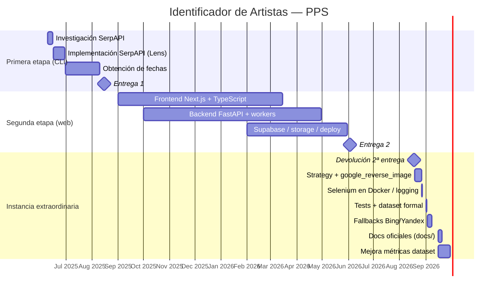

# Diagrama de Gantt

Cronograma de la PPS _Identificador de Artistas_. Formato Mermaid (se renderiza en GitHub).

**Hitos de referencia**

| Hito                       | Fecha                                       |
| -------------------------- | ------------------------------------------- |
| Inicio del proyecto        | Junio 2025                                  |
| Primera entrega (CLI)      | Agosto 2025                                 |
| Segunda entrega (web)      | 3 de junio de 2026                          |
| Devolución segunda entrega | 18 de agosto de 2026                        |
| Instancia extraordinaria   | Desde agosto 2026 (sin fecha límite formal) |

---

## Vista general

---

## Detalle por etapa

### Primera etapa (junio–agosto 2025)

Tomado del Gantt de la primera entrega:

| Tarea                                | Inicio    | Fin       |
| ------------------------------------ | --------- | --------- |
| Investigación SerpAPI                | 9/6/2025  | 15/6/2025 |
| Implementación SerpAPI (Google Lens) | 16/6/2025 | 29/6/2025 |
| Obtención de fecha de publicaciones  | 30/6/2025 | 10/8/2025 |

Producto: CLI Python + SerpAPI Google Lens.

### Segunda etapa (hasta 3/6/2026)

Evolución a arquitectura web: Next.js (Vercel), FastAPI (Render), Supabase, flujo asíncrono con polling, scoring y scraping estático. Entrega el **3 de junio de 2026**.

### Instancia extraordinaria (desde 18/8/2026)

Respuesta a la devolución: motor `google_reverse_image`, patrón Strategy, fallbacks Bing/Yandex, Selenium operativo en Docker, caché en DB, tests, dataset documentado y documentación formal en `docs/`.

---

## Tabla compacta (accesible sin render Mermaid)

| Fase                           | Periodo             | Entregable principal       |
| ------------------------------ | ------------------- | -------------------------- |
| CLI + Lens                     | jun–ago 2025        | Primera entrega            |
| Web full-stack                 | sep 2025 – jun 2026 | Segunda entrega (3/6/2026) |
| Contingencia motores + calidad | ago–sep 2026        | Instancia extraordinaria   |
